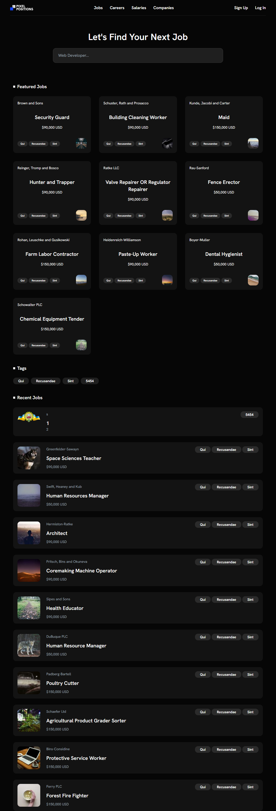

# Pixel Positions Job Board

A Laravel job board platform.  
This project demonstrates Laravel features such as routing, Blade components, Eloquent ORM, authentication, queues, and more, culminating in a job board where users can post and apply to jobs.



---

## 🚀 Overview

This repository reflects the structure and functionality from the **“30 Days to Learn Laravel”** series by Jeffrey Way. The final result is a fully functional job board called **Pixel Positions**, with these key features:

- **Featured Jobs** and **Recent Jobs** sections
- **Job Tags** for categorization and filtering
- **User Authentication** (Laravel Breeze)
- **Job CRUD operations**
- **Search and tagging system**
- **Eloquent ORM** usage with relationships, factories, migrations, seeders
- **TailwindCSS** for styling, powered by **Vite**
- Email notifications using **Mailable Classes**
- Background processing via **Queues**

---

## 📂 Project Structure Highlights

```
30days/
├── app/
│   └── (Your controllers, models, jobs, mailables, etc.)
├── database/
│   ├── migrations/
│   ├── seeders/
│   └── factories/
├── resources/
│   ├── views/
│   └── css & js assets (for Tailwind + Vite)
├── routes/
│   └── web.php, auth routes
├── .env.example
├── README.md
├── screencapture-30days.png
├── composer.json / package.json
└── tailwind.config.js / vite.config.js
```

---

## ⚡ Quick Start

1. **Clone the repository:**
   ```bash
   git clone https://github.com/SergioVasko/30days.git
   cd 30days
   ```

2. **Install dependencies:**
   ```bash
   composer install
   npm install
   npm run dev
   ```

3. **Configure your environment:**
   ```bash
   cp .env.example .env
   php artisan key:generate
   ```

4. **Run database migrations and seeders:**
   ```bash
   php artisan migrate --seed
   ```

5. **Run the development server:**
   ```bash
   php artisan serve
   ```

6. **Open the app:**
   Visit `http://127.0.0.1:8000` in your browser.

---

## 🌟 Feature Highlights

- **Routing & Views** using Blade components  
- **Eloquent Relationships**: `belongsTo`, `hasMany`, `belongsToMany`, with eager loading for performance  
- **Migrations, Factories & Seeders** to set up the initial database  
- **Forms & Validation**, including CSRF protection  
- **Authentication**: Registration and login via Laravel Breeze  
- **Job Workflow**: Full CRUD capabilities for job listings  
- **Emails & Queues**: Mailable classes and background queue processing  
- **Asset Compilation**: Frontend built with TailwindCSS and bundled by Vite  

---

## 📘 Development Journey

This project covers:

1. **Baby Steps** – Routes, views, and layout components  
2. **Eloquent ORM** – Models, relationships, migrations, seeders, pagination  
3. **Forms & Validation** – Secure form handling and CRUD  
4. **Authentication & Authorization** – Using Breeze and middleware logic  
5. **Advanced Features** – Emails, queues, asset compilation  
6. **Final Project** – A complete job board (Pixel Positions)

---

## 📸 Screenshots

- Home page

---

## 🤝 Contributing

You're welcome to contribute via issues or pull requests—just open one to propose updates or fixes.

---

## 📜 License

Distributed under the **MIT License**.

---

## 💡 Credits

Inspired by [Laracasts' *30 Days to Learn Laravel*](https://laracasts.com/series/30-days-to-learn-laravel) by **Jeffrey Way**.
